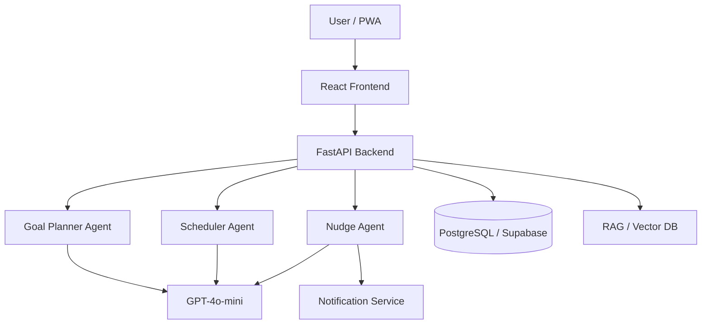

# 🎯 Flux Life Assistant

*"Transforming Goals into Daily Actions with Empathetic AI"*


---

## About the Project

Most people fail at their goals not because they lack motivation, but because they struggle to bridge the **Goal-to-Action Gap** — the disconnect between setting an ambitious target and knowing exactly what to do today, tomorrow, and next week to achieve it. Traditional productivity tools track tasks but don't understand context, adapt to disruptions, or offer encouragement when plans fall apart.

**Flux** is an AI-powered life assistant that closes this gap. Through natural conversation, Flux decomposes high-level goals (like "lose 15 lbs before my wedding") into personalized daily schedules with concrete, time-blocked actions. It monitors progress in real time, detects when tasks drift, and proactively reschedules your day — all while maintaining an empathetic, supportive tone.

What sets Flux apart is its **Compassionate Drift & Shuffle** engine. Instead of punishing missed tasks with guilt or rigid failure states, Flux intelligently redistributes your schedule, factors in your energy levels and priorities, and sends encouraging nudges to get you back on track. Life happens — Flux adapts with you.

> 📹 **Demo Video:** [Coming Soon](#)

---

## Features

**Empathetic Goal Breakdown** — An AI dialogue that understands your "why" before creating a plan. Flux asks the right questions to build a schedule rooted in your personal motivation, not generic templates.

**Context-Aware Reminders** — Smart notifications that factor in location, time of day, and behavior patterns. Flux knows when you're most productive and when a gentle nudge is more effective than an alarm.

**Compassionate Drift & Shuffle** — Missed a task? Flux reschedules with encouragement, not guilt. The drift engine evaluates what can shift, what's critical, and how to keep your day balanced.

**Multi-Channel Escalation** — Push notification → SMS → WhatsApp, escalating based on task priority and response history. Critical tasks don't get lost in notification noise.

**Pattern Learning** — Over time, Flux learns your productive hours, preferred routines, and common disruption patterns to build increasingly accurate schedules.

**Demo Mode** — Time-warp controls and scenario simulation tools for showcasing the full lifecycle — goal creation, drift detection, recovery — in minutes instead of weeks.

---

## Tech Stack

| Layer | Technology |
|-------|-----------|
| Frontend | React 18, TypeScript, Vite, Framer Motion, React Router |
| Backend | FastAPI, Python 3.11+ |
| Database | PostgreSQL via Supabase |
| AI/ML | GPT-4o-mini, RAG (Pinecone/Chroma) |
| Deployment | Vercel (Frontend), Railway/Render (Backend) |

---

## Architecture



Flux uses a **multi-agent architecture** where specialized AI agents handle distinct responsibilities. The **Goal Planner Agent** decomposes user goals into weekly milestones and daily tasks. The **Scheduler Agent** manages time-blocking, conflict resolution, and drift recovery. The **Nudge Agent** determines when, how, and through which channel to remind or encourage the user. All three agents share a common LLM backbone (GPT-4o-mini) and access user context through a RAG-powered vector database for personalized, history-aware responses.

---

## Getting Started

### Prerequisites

- Node.js 18+
- Python 3.11+
- Supabase account (or local PostgreSQL)

### Installation

```bash
# Clone the repository
git clone https://github.com/MacDavicK/Flux-Team-8.git
cd Flux-Team-8

# Frontend
cd frontend
npm install
cp .env.example .env
npm run dev

# Backend (in a separate terminal)
cd backend
python -m venv venv
source venv/bin/activate
pip install -r requirements.txt
cp .env.example .env
uvicorn main:app --reload
```

---

## Project Structure

```
flux/
├── frontend/          # React + Vite + TypeScript
│   ├── src/
│   │   ├── api/       # API integration layer
│   │   ├── components/# Reusable UI components
│   │   ├── hooks/     # Custom React hooks
│   │   ├── pages/     # Route pages
│   │   ├── styles/    # Global styles & theme
│   │   ├── types/     # TypeScript definitions
│   │   └── utils/     # Helper functions
│   ├── public/
│   └── package.json
├── backend/           # FastAPI + Python
│   ├── app/
│   │   ├── agents/    # AI agent modules
│   │   ├── api/       # Route handlers
│   │   ├── models/    # Database models
│   │   └── services/  # Business logic
│   ├── tests/
│   └── requirements.txt
├── docs/              # Documentation
└── README.md
```

---

## Development Workflow

- **Branches:** `feature/<name>`, `bugfix/<name>`, `hotfix/<name>`
- **Commits:** Conventional Commits (`feat:`, `fix:`, `docs:`, `chore:`)
- **PRs:** Require 1 review, must pass linting and type-check
- **Testing:** Unit tests for utilities, integration tests for API layer

---

## Roadmap

- [x] Week 1: Foundation — Project setup, routing, mock API (Feb 10–16)
- [ ] Week 2: Core Features — Calendar view, goal chat, task management (Feb 17–23)
- [ ] Week 3: AI Agents — Planner, scheduler, nudge agents (Feb 24–Mar 2)
- [ ] Week 4: Polish & Demo — Animations, edge cases, demo mode (Mar 3–9)

---

## Demo Day

- **Date:** Early March 2026
- **Duration:** 15–20 minutes
- **Key flows:** Goal creation → schedule generation → drift handling → recovery

---

## Team

| Name | Role | GitHub |
|------|------|--------|
| Harshal Kale | Team Leader | [@placeholder](#) |
| Session Mwamufiya | | [@placeholder](#) |
| Krishnan Iyer | | [@placeholder](#) |
| Sathish Kulal | | [@placeholder](#) |
| Hima | | [@placeholder](#) |
| Kavish Jaiswal | | [@placeholder](#) |

---

## Contributing

Contributions are welcome! Whether it's bug fixes, new features, or documentation improvements, we appreciate your help. Please read our [Contributing Guide](docs/CONTRIBUTING.md) for details on the development process, coding standards, and how to submit pull requests.

---

## License

MIT License © 2026 Flux Team. See [LICENSE](LICENSE) for details.

---

## Acknowledgments

- **Outskill AI Engineering Fellowship** — Cohort 3
- **Mentor:** Ramanathan Rm
- Built with React, FastAPI, and Supabase

---

⭐ Star this repo if you find it helpful!
