# 1. Vision

To become the **Life Assistant** that transforms abstract goals into achievable daily actions. "Flux" envisions a world where your personal AI partner understands your long-term aspirations, breaks them down into manageable routines, and guides you with context-aware, empathetic support — adapting to your life, not the other way around.

## 1.1 Industry

Productivity Software / Personal Information Management (PIM) / AI Life Coaching / Wellness Tech.

# 2. Core Problem Definition

**The Goal-to-Action Gap:** People set goals ("lose weight," "learn a skill," "be more organized") but struggle to translate them into consistent daily habits. Traditional tools fail because:

1. **Goal Ambiguity** — Users know *what* they want but not *how* to achieve it
2. **Rigid Reminders** — Time-based notifications ignore context (location, activity, energy)
3. **Shame Cycles** — Missed tasks trigger guilt, leading to tool abandonment
4. **No Adaptive Planning** — Plans don't evolve based on actual behavior patterns

**Flux solves this** by combining intelligent goal breakdown, context-aware nudging, and compassionate rescheduling into a voice-first Life Assistant.

## 2.1 Target Audience

- **Goal-Setters:** Individuals with aspirations (fitness, career growth, personal development) who struggle to create and maintain actionable plans
- **Busy Professionals:** Knowledge workers juggling multiple responsibilities who need intelligent prioritization and context-aware reminders
- **Neurodivergent Users:** People with ADHD or executive dysfunction who benefit from adaptive, shame-free task management
- **Lifestyle Optimizers:** Anyone seeking a personal AI assistant that understands their patterns and adapts to their life

## 2.2 Supported Goal Categories

| Category | Examples | Scope |
|----------|----------|-------|
| **Health & Fitness** | Weight loss, running a marathon, gym consistency, sleep improvement | v1 |
| **Career** | Learn new skill, earn certification, get promotion, job search prep | v1 |
| **Personal** | Morning routines, household chores, errands, relationship maintenance | v1 |
| Finance | Budgeting, saving goals, investment tracking | *v2* |
| Learning | Reading goals, course completion, language learning | *v2* |
| Relationships | Stay in touch with friends, date planning, family time | *v2* |

> [!TIP]
> **v2 Expansion:** Additional goal categories will be added via configurable templates, allowing community-contributed goal frameworks.

## 2.3 Goal Timeline Support

- **v1:** Goals up to **6 months** with weekly milestones and monthly checkpoints
- **v2:** Multi-year goals with quarterly reviews and annual retrospectives

## 2.4 Competitive Differentiation

| Competitor | Their Approach | Flux's Edge |
|------------|----------------|-------------|
| **Todoist** | Task lists with due dates; manual rescheduling | No understanding of *why* you missed; pure list management |
| **Reclaim.ai** | Auto-schedules around meetings | Rigid slots; no emotional intelligence; no pattern learning |
| **Motion** | AI auto-scheduler for teams | Enterprise-focused; no compassion layer; expensive |
| **Notion Calendar** | Unified workspace | Manual drag-drop; no AI intervention on failures |
| **Google Calendar** | Universal calendar | Binary missed/done; triggers shame via red "overdue" |

**Flux's Unique Value:**
1. **Goal Breakdown** — Transforms vague aspirations into structured plans via empathetic dialogue
2. **Context-Aware Nudging** — Reminds based on location, activity, and state—not just time
3. **Compassionate AI** — Treats missed tasks as data, not failures
4. **Pattern Learning** — "You always skip gym on Mondays" → stops scheduling there
5. **Voice-First** — Primary interaction is conversational, not form-filling
6. **Autonomous Rescheduling** — No button press needed; AI proactively adapts your day
7. **Escalation Intelligence** — Multi-channel notifications (app → SMS/WhatsApp → call) based on urgency

# 3. Domain Expertise Alignment

* **Multi-Agent AI Architecture:** Orchestrates five specialized AI agents—Goal Planner, Sensor, Observer, Empath, and Scheduler—each handling distinct cognitive tasks (goal decomposition, context inference, pattern learning, emotion detection, calendar orchestration) to create emergent intelligent behavior.
* **LLM Tool Use & Multi-Turn Dialogue:** Leverages GPT-4o-mini for function calling, natural language understanding, and empathetic multi-turn conversations that progressively extract context without overwhelming users.
* **On-Device ML for Privacy-First Intelligence:** Deploys TensorFlow Lite models for speech emotion recognition and context awareness (location, phone state), ensuring sensitive data never leaves the device while enabling real-time adaptive behavior.
* **Lightweight Reinforcement Learning:** Implements pattern learning via RL models that track accept/reject/miss rates per (task-category, day, time) tuple, enabling the system to learn and adapt to user behavior over time.
* **Voice-First Conversational UX:** Combines Speech-to-Text (Whisper), Text-to-Speech (ElevenLabs/OpenAI), and real-time emotion detection to create a fluid, natural interaction paradigm that reduces form-filling friction.
* **Constraint Satisfaction & Calendar Logic:** Applies complex scheduling algorithms to resolve conflicts, negotiate tradeoffs, and maintain calendar fluidity while respecting user-defined constraints (work hours, energy peaks).
* **Frontend Fluidity:** Utilizes React and Framer Motion expertise to build calming, anxiety-reducing UI with smooth task animations (ghosting, morphing) that differentiate Flux from utilitarian corporate tools.

# 4. Success Criteria

### 4.1 Goal Breakdown Effectiveness

| Metric | Target | Measurement |
|--------|--------|-------------|
| **Context Extraction Completion** | >85% of goal dialogues result in a scheduled plan | Plans created ÷ Goal conversations initiated |
| **Plan Acceptance Rate** | >70% of AI-generated plans accepted without major modification | Accepted as-is ÷ Total plans proposed |
| **Milestone Adherence** | >60% of weekly milestones marked complete | Completed milestones ÷ Scheduled milestones |

### 4.2 Context-Aware Reminder Performance

| Metric | Target | Measurement |
|--------|--------|-------------|
| **Contextual Trigger Accuracy** | >80% of location/activity reminders delivered at the right moment | User-confirmed "good timing" ÷ Total contextual reminders |
| **Escalation Effectiveness** | >90% of must-not-miss tasks acknowledged within escalation window | Acknowledged ÷ Must-not-miss tasks triggered |
| **Channel Preference Learning** | <3 weeks to learn user's preferred notification channel per task type | Time to stable channel selection |

### 4.3 Pattern Learning & Adaptation

| Metric | Target | Measurement |
|--------|--------|-------------|
| **Pattern Detection Accuracy** | >75% of detected patterns confirmed by user | User-confirmed patterns ÷ Patterns suggested |
| **Scheduling Optimization** | 50% reduction in missed tasks after 4 weeks of learning | Week 4 miss rate ÷ Week 1 miss rate |
| **Preference Inference** | >80% accuracy in predicting task time preferences | Predicted slot accepted ÷ Total predictions |

### 4.4 Rescheduling & Drift Resolution

| Metric | Target | Measurement |
|--------|--------|-------------|
| **Shuffle Acceptance Rate** | >70% of AI-suggested reschedule slots accepted without modification | Accepted as-is ÷ Total shuffle suggestions |
| **Drift Resolution** | >80% of drifted tasks resolved within 24 hours | Resolved ÷ Drifted tasks |
| **Rescheduling Latency** | <2 seconds for AI logic + database update | P95 latency |

### 4.5 Voice Interaction Quality

| Metric | Target | Measurement |
|--------|--------|-------------|
| **Voice Command Success Rate** | >90% of voice commands correctly understood | Successful parses ÷ Total voice inputs |
| **Sentiment Detection Accuracy** | >75% accuracy in stress/energy detection | User-validated state ÷ Detected states |
| **Conversation Completion Rate** | >85% of multi-turn dialogues completed without abandonment | Completed dialogues ÷ Initiated dialogues |

# 5. Technical Stack Decision

## 5.1 Frontend

* Others (React + Vite + Framer Motion)
* **Platform:** Mobile Web (PWA) — optimized for touch, responsive design for phones
* **Rationale:** Streamlit is insufficient for the complex, drag-and-drop, and state-driven animations required to make the calendar feel "fluid." React offers the necessary control for the `layoutId` animations (ghosting/morphing tasks). PWA provides installable experience with push notifications across iOS/Android within 3-week timeline.

## 5.2 Backend

* FastAPI (recommended)
* **Rationale:** Essential for high-performance asynchronous handling of Google Calendar Webhooks and concurrent AI requests.

## 5.3 Gen AI Component & AI Agents

Flux employs **five distinct AI agents** working in concert:

### 5.3.1 Goal Planning Agent ("The Goal Planner")

**Purpose:** Transform vague user goals into structured, trackable plans through empathetic dialogue.

| Input | Processing | Output |
|-------|------------|--------|
| "Lose weight for wedding" | Extract timeline, current state, preferences via multi-turn dialogue | 6-week plan with weekly milestones |
| "Learn Python" | Assess current level, available time, learning style | 30-day curriculum with daily tasks |
| "Run a 5K" | Check fitness level, timeline, equipment | Progressive running schedule |

**Implementation:**
- Multi-turn conversational context extraction using GPT-4o-mini
- Template-based plan generation (v1: Light depth — high-level milestones)
- Weekly milestone creation with check-in tasks
- Integration with Observer for progress tracking

> [!TIP]
> **v2 Enhancement:** Deep personalization with calorie targets, specific workout plans, and external app integration (Apple Health, Fitbit, Strava).

### 5.3.2 Context Awareness Agent ("The Sensor")

**Purpose:** Use device signals to infer user context and adjust schedule proactively.

| Signal | Inference | Action |
|--------|-----------|--------|
| GPS shows user still commuting | Running late | Delay next task by 15 min |
| Screen time API shows user in meeting app | Busy | Don't interrupt with nudges |
| Phone in Do Not Disturb | Focused/sleeping | Queue notifications for later |
| Calendar shows "Flight to NYC" | Traveling | Pause non-essential tasks for the day |

**Privacy Safeguards:**
- 100% on-device processing (no location/activity data leaves phone)
- Opt-in only with granular permissions
- User can disable anytime; AI falls back to time-based heuristics

### 5.3.3 Pattern Learning Agent ("The Observer")

**Purpose:** Learn user behavior patterns over time to make smarter suggestions.

| Input | Pattern Detected | Action |
|-------|------------------|--------|
| User skips "Gym" every Monday for 4 weeks | Monday gym aversion | Stop suggesting Monday gym slots; ask user to confirm |
| User always completes "Deep Work" at 9 AM | Peak productivity window | Protect 9 AM for high-priority tasks |
| User reschedules "Admin Tasks" 3x in a row | Chronic avoidance | Move to Cold Storage (v2); suggest dropping or delegating |

**Implementation:**
- Lightweight RL model tracking accept/reject/miss rates per (task-category, day, time) tuple
- Weekly pattern digest shown to user: "I noticed you prefer workouts after 5 PM. Should I update your preferences?"

### 5.3.4 Sentiment & Stress Detection Agent ("The Empath")

**Purpose:** Gauge user emotional state from voice input to adjust tone and urgency.

| Voice Signal | Detected State | AI Response |
|--------------|----------------|-------------|
| Fast speech, short answers | Stressed/rushed | Reduce nudge frequency; offer to clear low-priority tasks |
| Slow, tired tone | Low energy | Suggest lighter tasks; ask "Rough day? Want me to move things to tomorrow?" |
| Upbeat, engaged | High energy | Propose tackling challenging tasks |

**Implementation:**
- On-device speech emotion recognition (e.g., TensorFlow Lite model)
- No audio stored; only emotion labels used

### 5.3.5 The Scheduler Agent (Core Orchestrator)

**Purpose:** Central agent that coordinates all other agents and executes calendar operations.

**Key Responsibilities:**
1. **Conflict Resolution:** Looking at the calendar, identifying free space, and validating it against user constraints.
2. **Negotiation:** If no perfect slot exists, it formulates a tradeoff question.
3. **Agent Coordination:** Receives inputs from Observer, Sensor, Empath, and Goal Planner agents.

**Tools (Function Calling):**
* `get_calendar_events`
* `update_event_time`
* `get_user_preferences`
* `classify_task`
* `get_user_patterns`
* `move_to_cold_storage` (v2)
* `create_goal_plan`
* `get_nearby_locations`

### 5.3.6 Core LLM (GPT-4o-mini)

**Purpose:** General intelligence for tool use, content generation, and dialogue.

| Capability | Usage |
|------------|-------|
| **Tool Use** | Extract time constraints from natural language |
| **Conversational Negotiation** | Multi-turn dialogue when conflicts arise |
| **Content Generation** | Generate encouraging, non-shaming nudge messages |
| **Task Classification** | Determine if task is one-time vs repetitive |

**Provider:** OpenAI Direct

### 5.3.7 Agent Orchestration Diagram

```mermaid
flowchart TD
    subgraph Agents
        O[🔍 The Observer<br/>Pattern Learning]
        S[📍 The Sensor<br/>Context Awareness]
        E[💚 The Empath<br/>Sentiment Detection]
        GP[🎯 The Goal Planner<br/>Goal Breakdown]
    end

    subgraph Core
        SC[🗓️ The Scheduler<br/>Main Orchestrator]
        LLM[🧠 GPT-4o-mini]
    end

    GP -->|"Structured plan"| SC
    O -->|"User patterns"| SC
    S -->|"Current context"| SC
    E -->|"Emotional state"| SC
    SC <-->|"NL Understanding<br/>Negotiation"| LLM
    SC -->|"Calendar Actions"| API[📅 Google Calendar API]
    SC -->|"Notifications"| N[🔔 Multi-Channel<br/>Notification System]
```

## 5.4 Database & Data Processing

* Vector database (Not needed for v1)
* Traditional database (PostgreSQL)
* **Rationale:** Calendar events are highly structured relational data (Time, Duration, User ID).

* Data processing libraries (Pandas - optional, mostly Python standard `datetime` and `pydantic`).

## 5.5 Data Requirements

### 5.5.1 Source

* **Primary:** Google Calendar API (User's own live calendar).
* **Secondary:** User input (Natural language tasks, Preferences).

### 5.5.2 Format & Accessibility

* Yes, JSON format via Google API.

### 5.5.3 License/Permission

* User grants explicit permission via OAuth 2.0.

### 5.5.4 Availability Timeline

* Immediate (API is public).

### 5.5.5 Does it contain PII? Do you have permission to include it?

* **Yes:** Event titles, descriptions, and attendees.
* **Permission:** Handled via Google's strict OAuth consent screen. Data must be encrypted at rest and never used for training models without consent.

# 6. Feature Prioritization

## 6.1 Primary Core Features

1. **Goal Breakdown Engine:** Transform vague goals ("lose weight for wedding") into structured plans via empathetic dialogue
2. **"The Drift & Shuffle":** Automatically detect when a task's end-time has passed—AI reschedules to the next best slot
3. **Context-Aware Reminders:** Location and activity-based nudging (not just time-based)

## 6.2 Supporting Features

1. **Google Calendar 2-Way Sync:** Changes in Flux reflect in GCal, and vice versa.
2. **Natural Language Input:** "Run 3x this week" -> Auto-books 3 slots.
3. **Constraint Settings:** A simple onboarding form where users define "Work Hours" and "Energy Peak Times" (v2).
4. **Task Classification:** Auto-detect or ask if task is one-time vs repetitive, must-not-miss vs nice-to-have.
5. **Cold Storage / Parking Lot:** (v2) Chronically avoided tasks (3+ reschedules) are moved to cold storage with weekly review prompts.
6. **Multi-Channel Notifications:** App → WhatsApp/SMS → Phone call escalation based on urgency

## 6.3 Agent Summary

| Agent | Role |
|-------|------|
| **The Goal Planner** | Goal breakdown & structured plan creation |
| **The Sensor** | Context awareness (location, phone state) — *Opt-in with demo simulation* |
| **The Observer** | Pattern learning & behavioral insights |
| **The Empath** | Sentiment/stress detection from voice |
| **The Scheduler** | Core orchestration, calendar actions, negotiation |

# 7. Complex Real-World Scenarios

These scenarios document edge cases and the AI's decision logic for handling them.

---

## Scenario 1: Goal Breakdown & Context Extraction (Flux's Edge)

**Context:** User says "I want to lose weight for a wedding"

```mermaid
flowchart TD
    A["🎤 User: 'I want to lose weight<br/>for a wedding'"] --> B[Goal Planner Agent<br/>identifies missing context]
    B --> C{Required context<br/>complete?}
    C -->|No| D[Empathetic<br/>questioning loop]

    D --> E["'That's a great goal! 💪<br/>When is the wedding?'"]
    E --> F["User: 'March 15th'"]
    F --> G["'Perfect! That gives us<br/>about 6 weeks. What do<br/>you weigh now, if you<br/>don't mind sharing?'"]
    G --> H["User: '85 kg'"]
    H --> I["'And what's your target?<br/>Or should I suggest a<br/>healthy goal?'"]
    I --> J["User: '75 kg'"]
    J --> K["'Do you prefer gym,<br/>home workouts, or<br/>mostly diet changes?'"]
    K --> L["User: 'Gym and diet'"]

    L --> M{All context<br/>gathered}
    M --> N[🧠 Generate Plan]
    N --> O[Break into weekly<br/>milestones]
    O --> P[Create recurring<br/>tasks & check-ins]
    P --> Q["'Here's your 6-week plan!<br/>I'll remind you about workouts<br/>and check in weekly on progress.<br/>Sound good?'"]
    Q --> R{User confirms?}
    R -->|Yes| S[✅ Plan activated<br/>Tasks scheduled]
    R -->|"Adjust"| T[Modify plan based<br/>on feedback]
```

**Key Behaviors:**
1. **Progressive context extraction** — Never overwhelming with all questions at once
2. **Motivational tone** — Celebrate the goal, validate feelings
3. **Smart defaults** — Offer healthy weight loss targets (0.5-1 kg/week) if user unsure
4. **Plan output** — Concrete weekly milestones with trackable tasks

**Sample Generated Plan:**
| Week | Milestone | Tasks |
|------|-----------|-------|
| 1 | Baseline & Habits | 3x gym sessions, log meals daily, weigh-in Sunday |
| 2-3 | Build Consistency | 4x gym sessions, meal prep Sundays |
| 4-5 | Intensify | Add cardio, reduce portions |
| 6 | Final Push | Daily activity, wedding prep focus |

---

## Scenario 2: Context-Aware Location Reminders

**Context:** User says "Remind me to pick up tomatoes from the grocery store"

```mermaid
flowchart TD
    A["🎤 'Remind me to pick up<br/>tomatoes from grocery'"] --> B[LLM detects<br/>no time specified]
    B --> C{Time-based or<br/>Context-based?}
    C -->|Context-based| D[Create location-aware<br/>reminder]

    D --> E["'Got it! I'll remind you<br/>when you're out near a store.'"]
    E --> F[Task stored with<br/>trigger: leaving_home<br/>OR near_grocery]

    F --> G{Sensor detects<br/>user left home?}
    G -->|Yes| H[📱 App Notification]
    H --> I["'You're out! Want to pick up<br/>tomatoes now? 🍅<br/>Closest grocery: 0.3 mi'"]

    I --> J{Response within<br/>2 minutes?}
    J -->|"Done"| K[✅ Mark complete]
    J -->|"Snooze"| L["'When should I<br/>remind you again?'"]
    J -->|No response| M[📲 WhatsApp/SMS]

    M --> N["'Hey! Don't forget<br/>the tomatoes 🍅'"]
    N --> O{Response within<br/>5 minutes?}
    O -->|Yes| P[Handle response]
    O -->|No response| Q[📞 Phone Call]
    Q --> R["Quick voice reminder<br/>with snooze option"]
```

**Escalation Ladder:**

| Step | Channel | Timing | Fallback |
|------|---------|--------|----------|
| 1 | 📱 App Notification | When trigger fires | Wait 2 min → Step 2 |
| 2 | 📲 WhatsApp/SMS | +2 min if no response | Wait 5 min → Step 3 |
| 3 | 📞 Phone Call | +7 min if no response | Mark as "needs attention" |

**Location Intelligence:**
- Uses device GPS (opt-in) to detect when user leaves home
- Geo-search finds nearby grocery stores and includes distance in notification
- If location disabled: Falls back to time-based reminder ("When do you usually shop?")

**Demo Simulation:**
For demo day, the app includes controls to simulate:
- "Simulate Leaving Home" button triggers the location-aware flow
- "Simulate Near Store" shows proximity-based notification
- "Escalation Speed" slider (1x/5x/10x) accelerates the notification cascade

---

## Scenario 3: Pattern Learning in Action

**Context:** User has skipped "Gym" on Monday for 4 consecutive weeks.

---

## Scenario 4: Voice-First Task Creation

**Context:** User says "Remind me to call mom on her birthday next month"

```mermaid
flowchart TD
    A[🎤 Voice Input Captured] --> B[Speech-to-Text]
    B --> C[LLM Parses Intent]
    C --> D{All info present?}
    D -->|No - Missing date| E["'When is your mom's<br/>birthday?'"]
    E --> F[User: 'February 15th']
    F --> G[LLM extracts Feb 15]
    G --> H{Is this one-time<br/>or recurring?}
    H -->|Inferred: Yearly birthday| I["'I'll remind you every<br/>Feb 15th. Sound good?'"]
    D -->|Yes| I
    I --> J{User confirms?}
    J -->|Yes| K[✅ Task Created]
    J -->|"No, just this year"| L[Create one-time task]
```

---

## Scenario 5: Multi-Turn Voice Negotiation

**Context:** AI suggests 5 PM for Gym. User declines twice.

---

## Scenario 6: Missed Repetitive Task (Same-Day Impossible)

**Context:** "Go to Gym" was scheduled for 7 AM. It's now 11:30 PM.

```mermaid
flowchart TD
    A[⏰ 'Gym' at 7AM missed] --> B{Is same-day<br/>reschedule possible?}
    B -->|Check time| C{Current time<br/>< 9 PM?}
    C -->|Yes| D[Offer evening slot]
    C -->|No - Too late| E[💤 Cannot reschedule today]
    E --> F[Voice notification]
    F --> G["'Gym didn't happen today.<br/>No worries — I've kept your<br/>slot for tomorrow at 7 AM.<br/>Want me to adjust the time?'"]
    G --> H{User Response}
    H -->|"Make it 6 AM"| I[Update recurring pattern]
    H -->|"That's fine"| J[Keep original schedule]
    H -->|No response| K[Proceed with default]
```

**Key Behavior:** Acknowledge without shame, automatically preserve next occurrence, offer adjustment.

---

## Scenario 7: User Has Notifications Disabled (Escalation)

**Context:** User has phone on DND and has disabled push notifications. Critical task "Submit Tax Filing" is due in 2 hours.

```mermaid
flowchart TD
    A[📋 Critical Task Due Soon] --> B{Check task priority}
    B -->|Must-Not-Miss| C{Can send push?}
    C -->|No - Disabled| D{Email available?}
    D -->|Yes| E[📧 Send Email Reminder]
    D -->|No| F{WhatsApp/VoIP<br/>configured?}
    F -->|Yes| G[📞 Initiate VoIP Call]
    F -->|No| H[Queue for next app open]
    E --> I{User responded?}
    G --> I
    I -->|No after 30 min| J[Escalate to next channel]
    I -->|Yes| K[✅ Acknowledged]
```

**Escalation Ladder:**
1. In-app notification (if app open)
2. Push notification (if enabled)
3. Email (always available)
4. WhatsApp message (if connected)
5. VoIP call (if connected and critical)

---

## Scenario 8: Missed One-Time Appointment (Manually Handled)

**Context:** User had "Doctor's Appointment at 3 PM" but it's now 4 PM.

**Key Behavior:** AI does NOT autonomously reschedule. It acknowledges the miss and offers to create a follow-up action.

# 8. Conversational Voice Interface

Flux is designed as a **voice-first** application. Speech is the primary input method; text serves as fallback.

## 8.1 Voice Architecture

```mermaid
flowchart LR
    subgraph Input
        M[🎤 Microphone]
        T[⌨️ Text Fallback]
    end

    subgraph Processing
        STT[Speech-to-Text<br/>Whisper API]
        LLM[GPT-4o-mini<br/>Intent + Response]
        TTS[Text-to-Speech<br/>ElevenLabs/OpenAI]
    end

    subgraph Output
        S[🔊 Speaker]
        UI[📱 Visual Confirmation]
    end

    M --> STT --> LLM
    T --> LLM
    LLM --> TTS --> S
    LLM --> UI
```

## 8.2 Interaction Modes

| Mode | Trigger | Use Case |
|------|---------|----------|
| **Push-to-Talk** | Hold button | Precise commands in noisy environments |
| **Wake Word** | "Hey Flux" | Hands-free operation |
| **Continuous Listen** | Settings toggle | Accessibility users |

## 8.3 Response Types

| Type | Format | Example |
|------|--------|---------|
| **Confirmation** | Voice + Brief UI toast | "Got it. Gym is now at 6 PM." |
| **Negotiation** | Voice + Choice buttons | "5 PM or 7 PM?" with tap targets |
| **Alert** | Voice + Modal | "You have a conflict. Let's sort it out." |
| **Quick Action** | Notification + Yes/No/Other buttons | Minimal interaction for simple decisions |

## 8.4 Notification Escalation Channels

Multi-channel notification system with intelligent escalation based on task urgency and user response:

| Priority | Channel 1 | Channel 2 (if no response) | Channel 3 (if still no response) |
|----------|-----------|---------------------------|----------------------------------|
| **Standard** | 📱 Push Notification | — | — |
| **Important** | 📱 Push Notification | 📲 WhatsApp/SMS (+2 min) | — |
| **Must-Not-Miss** | 📱 Push Notification | 📲 WhatsApp/SMS (+2 min) | 📞 Phone Call (+7 min) |

**Channel Details:**
1. **In-App Voice Alert** — Primary when app is active
2. **Push Notification** — Immediate fallback
3. **WhatsApp Business API** — Direct message with quick-reply buttons (requires user opt-in)
4. **VoIP Call (Twilio)** — For absolute critical items; user-configurable sensitivity

# 9. Demo Mode & Sandbox

An integrated demo mode allows anyone to experience Flux's failure-handling flows without waiting for real time to pass.

## 9.1 Activation

```mermaid
flowchart TD
    A[Settings Menu] --> B[Toggle 'Demo Mode']
    B --> C{Confirmation}
    C -->|Confirm| D[🎮 Demo Panel Appears]
    D --> E[Normal UI + Demo Controls]
```

## 9.2 Demo Panel Controls

| Control | Function |
|---------|----------|
| **Time Warp** | Slider to "fast-forward" time by 1-24 hours |
| **Force Miss** | Select any upcoming task → immediately mark as drifted |
| **Simulate DND** | Act as if notifications are disabled |
| **Trigger Conflict** | (v2) Add a fake calendar event overlapping existing task |
| **Reset State** | Return to fresh demo with sample tasks |
| **Goal Setup Demo** | Pre-filled "Wedding Weight Loss" goal extraction flow |
| **Simulate Leaving Home** | Triggers context-aware reminder cascade |
| **Simulate Near Store** | Shows geo-proximity notification with store suggestions |
| **Escalation Speed** | 1x/5x/10x speed for notification cascade demo |

## 9.3 Sample Demo Flow for Demo Day

## 9.4 Demo Flow: Goal Breakdown

## 9.5 Demo Flow: Context-Aware Reminder

```mermaid
sequenceDiagram
    participant D as Demonstrator
    participant F as Flux App
    participant A as Audience

    Note over D,A: Context Reminder Setup
    D->>F: "Remind me to get tomatoes from grocery"
    F->>D: "Got it! I'll remind you when you're out"

    Note over D,A: Simulate Leaving Home
    D->>F: Click 'Simulate Leaving Home'
    F-->>A: App notification appears
    F->>D: "You're out! Closest grocery is 0.3mi"

    Note over D,A: Simulate No Response
    D->>F: Click 'Skip to Escalation'
    F-->>A: WhatsApp notification shown
    F->>D: "Hey! Don't forget the tomatoes 🍅"

    D->>F: Continue escalation
    F-->>A: Phone call interface shown
```

## 9.6 Demo Data Seed

Pre-populated demo account includes:
- 5 sample tasks across different categories (Work, Health, Personal)
- 1 task already in cold storage
- 1 must-not-miss task (for conflict demo)
- User preferences pre-configured (9-5 work, evening workouts)
- 1 pending goal ("Run a 5K") with milestones
- 1 context-aware reminder ("Pick up groceries") ready for location trigger

# 10. UI/UX

## 10.1 Is this an API only app or will have GUI as well?

**GUI:** A rich, responsive mobile web application (PWA).

## 10.2 Screens and Flows

| Screen Name | What action(s) can user take here? |
| --- | --- |
| **Login / Onboarding** | Google OAuth Login; Set "Work Hours" & "Sleep Time"; Select goal categories. |
| **Goal Setup Conversation** | Voice/text dialogue to define goals; AI extracts context via empathetic questions. |
| **Goal Dashboard** | View active goals with progress bars; Weekly milestones; Check-in prompts. |
| **The Fluid Dashboard** | View Day/Week column; See "Drifting" (ghosted) tasks; Drag & Drop events. |
| **Command Bar (Cmd+K)** | Type natural language to add tasks (e.g., "Lunch with Mom tomorrow"). |
| **The Negotiation Modal** | Appears when "Shuffle" is clicked. Shows the proposed new time with "Accept" or "Edit" buttons. |
| **Cold Storage / Parking Lot** | View chronically avoided tasks; Revive or permanently drop. |
| **Demo Controls Panel** | Time warp, force-miss, simulate location triggers (Demo Mode only). |
| **Voice Waveform Overlay** | Visual feedback during voice input; Cancel button. |

# 11. Hosting

* **Frontend:** Vercel (Optimized for React/Vite).
* **Backend:** Railway or Render (Easy Docker/Python deployment).
* **Database:** Neon (Serverless Postgres) or Supabase.

# 12. Guardrails

## 12.1 Content Generation Guardrail

* **Refusal:** The system will refuse to delete existing meetings with other attendees (unless explicitly confirmed).
* **Tone:** The AI must never use shaming language (e.g., "You failed again"). It must always use neutral or supportive language ("Let's find a better time").

## 12.2 Biases

* **Time Bias:** Ensure the model doesn't assume standard 9-5 hours for everyone (relying on user preferences instead).

## 12.3 Explainability

* **Rationale Display:** When the AI suggests a new time, it must display a tiny tooltip explaining *why*: "Suggested 6 PM because you prefer evening workouts and 5 PM was blocked."

## 12.4 Privacy & Data Protection

* **On-Device Processing:** Context awareness (location, phone state) uses on-device ML only — no data leaves the phone.
* **Voice Data:** No audio recordings stored; only transcripts/emotion labels used.
* **Opt-In Everything:** All sensor-based features require explicit user consent with granular controls.

# 13. v2 Feature Roadmap

The following features are documented for future expansion after initial release:

| Feature | v1 (Current) | v2 (Future) |
|---------|--------------|-------------|
| **Goal Categories** | Health & Fitness, Career, Personal | Finance, Learning, Relationships |
| **Goal Timeline** | Up to 6 months | Multi-year with quarterly reviews |
| **Plan Depth** | Light (high-level milestones) | Deep (calories, specific workouts, curricula) |
| **External Integrations** | None | Apple Health, Fitbit, Strava, MyFitnessPal |
| **Location Permissions** | Opt-in with demo simulation | Core feature requirement |
| **Conflict Resolution** | Internal Logic | External Calendar Conflict (2-way sync) |
| **Vector Database** | Not required | RAG for personalized recommendations |

> [!TIP]
> v2 features will be prioritized based on user feedback and usage patterns from the initial release.

## 13.1 Complex Scenarios (Deferred to v2)

### Scenario v2-1: Chronic Task Avoidance (Cold Storage Trigger)

**Context:** "Write Blog Post" has been auto-rescheduled 3 times.

```mermaid
flowchart TD
    A[Task rescheduled<br/>for 3rd time] --> B[🚨 Chronic Avoidance Detected]
    B --> C[Voice Prompt to User]
    C --> D["'I've moved Write Blog Post<br/>three times now. It seems like<br/>this one's hard to get to.<br/>What would you like to do?'"]
    D --> E{User Choice}
    E -->|"Drop it"| F[🗑️ Archive as Dropped]
    E -->|"Keep trying"| G[Reset reschedule counter<br/>Continue scheduling]
    E -->|"Cold Storage"| H[❄️ Move to Parking Lot]
    E -->|"Break it down"| I[🔨 AI helps create subtasks]
    H --> J[Task hidden from calendar<br/>Weekly digest shows cold items]
```

**Cold Storage Rules:**
- Tasks in cold storage don't clutter the calendar
- Weekly "Cold Storage Review" prompt asks user to revive or permanently drop
- Patterns are tracked: "You have 5 writing tasks in cold storage. Would you like to batch-schedule a writing day?"

---

### Scenario v2-2: Conflicting High-Priority Tasks (Advanced)

**Context:** "Client Call" and "Submit Report" both marked must-not-miss, same time slot.

---

### Scenario v2-3: Energy-Aware Rescheduling

**Context:** User defined "Peak Energy: 9-11 AM" in preferences. A low-priority email task drifts into this window.

```mermaid
flowchart TD
    A[🔄 Auto-reschedule triggered] --> B{Is target slot<br/>in Peak Energy?}
    B -->|Yes| C{Is task<br/>high-priority?}
    C -->|No| D[Skip this slot]
    D --> E[Find lower-energy slot]
    E --> F[Afternoon/evening slot selected]
    C -->|Yes| G[✅ Schedule in peak slot]
    B -->|No| G
```

---

### Scenario v2-4: External Calendar Conflict (Google Sync Two-Way)

**Context:** Someone adds a meeting to user's Google Calendar that conflicts with Flux-scheduled focus time.

---

# 14. Roadmap for MVP (demo day)

For a 2–3 week demo, anchor on one powerful story: “voice goal → empathetic breakdown → calendar plan → drift & shuffle → push/WhatsApp/call escalation,” and fake or defer almost everything else. ## MVP demo: what to keep

These are the **must-have** slices for demo day in 2–3 weeks:

## 14.1 Core experience

- **Single goal category and scenario**
  - Keep just one **Health & Fitness** scenario: “I want to lose weight for a wedding.”
  - Implement the multi‑turn **Goal Planner** conversation exactly like the spec’s example, but only for this pattern.

- **Goal breakdown → milestones → tasks (simplified)**
  - Generate a 6‑week plan with weekly milestones and a few recurring gym tasks; you do not need fully generic templates.

- **Fluid calendar dashboard (simplified)**
  - Basic day/week view with 3–5 tasks, ghosting animation when a task drifts, and smooth “move to tomorrow” animation.
  - Tasks can live purely in your own DB; real Google Calendar sync is v2.

- **Drift & Shuffle (happy path only)**
  - When “Gym at 10 AM” is missed (via time warp or Force Miss), mark as drifted, show ghost animation, and let AI propose “5 PM or tomorrow 7 AM” with a simple Negotiation Modal.

### Voice and AI

- **Voice-first goal setup (happy path)**
  - Push‑to‑talk only; no wake word or continuous listen.
  - Whisper → GPT‑4o‑mini → TTS loop for: single goal setup flow and 1–2 simple commands like “Remind me to get tomatoes from grocery.”

- **LLM orchestration (minimal agents)**
  - Implement just:
    - **Goal Planner**: scripted prompt chain for goal breakdown.
    - **Scheduler**: deterministic rules to pick free slots from an internal calendar.
  - Observer/Sensor/Empath can be **hard-coded behaviors** or stubs (see below).

### Notifications and escalation

- **Push notifications (real)**
  - In‑app + mobile push for reminders and drifted tasks.

- **WhatsApp escalation (real or convincingly stubbed)**
  - Minimal WhatsApp integration: send a templated message “Hey! Don’t forget the tomatoes” with a link; or simulate via a preconfigured sandbox number.

- **Call escalation (demo-path)**
  - Integrate Twilio (or similar) to show a triggered VoIP call UI for a must‑not‑miss task, even if the “user response” is scripted.
  - You only need the Scenario 7 ladder for one path: push → WhatsApp → call.

### Demo mode

- **Demo mode toggle + a few controls**
  - Settings toggle “Demo Mode” that reveals a small demo panel.
  - Implement only these controls for demo:
    - Time Warp (coarse slider or simple “Skip ahead” button)
    - Force Miss (on a single task)
    - Simulate Leaving Home
    - Escalation Speed (can just change timers).

- **Pre‑seeded demo data**
  - One prefilled user with:
    - “Lose weight for a wedding” goal, milestones, recurring gym tasks.
    - A grocery reminder (“Pick up tomatoes”).
    - One must‑not‑miss task for escalation demo.

## 14.2 What to explicitly cut or fake for the demo

These are **out-of-scope** or “fake behind the scenes” for a 2–3 week MVP:

### Scope cuts

- **No real Google Calendar two‑way sync**
  - Keep the calendar internal to Flux; you can show a “Google Calendar” label purely as UI.

- **Most goal types and timelines**
  - Drop Career, Personal, Finance, Learning, Relationships; show Health & Fitness only.
  - Only support goals up to 6 weeks–2 months in practice, with one canned template.

- **Advanced Pattern Learning (Observer)**
  - No true RL; instead, hard‑code the “you always skip gym on Mondays” scenario for demo data and a simple counter.

- **Real on-device ML (Sensor, Empath)**
  - Don’t build TensorFlow Lite models in 2–3 weeks.
  - Simulate context via demo controls (“Simulate Leaving Home,” “Simulate DND”) and simple keyword‑based “empathy” (“rough day” → more supportive tone).

- **Cold Storage / Parking Lot mechanics**
  - You can show a static “Parking lot” screen, but full chronic avoidance logic and weekly cold‑storage reviews are v2.

- **Complex conflict resolution & external meeting logic**
  - Do not build v2 scenarios like conflicting must‑not‑miss tasks or external meeting conflict handling.

- **Full settings, multi-user support, full security hardening**
  - Just enough OAuth for your backend/OpenAI; keep user management and privacy UX minimal.

### UX & architecture simplifications

- **Agents as modules, not separate services**
  - Implement all agents as functions in one FastAPI service; no microservices.

- **Single interaction mode**
  - Push‑to‑talk only; skip wake word and continuous listening modes.

- **Limited notification channels**
  - Email, SMS, rich WhatsApp quick replies can be mocked for v2; only implement minimal actual push + one WhatsApp + one call escalation path.

## 14.3 Concrete 2–3 week demo checklist

Use this as a “build list” for the team:

1. **PWA shell**: Login (even mock), Fluid Dashboard day view with 3–5 seeded tasks and simple drag‑to‑tomorrow.
2. **Goal setup flow (voice + text)**: “Lose weight for a wedding” dialog that creates a 6‑week plan and populates tasks.
3. **Drift & Shuffle**: Force Miss button → ghosted task → Negotiation Modal → animated reschedule.
4. **Grocery reminder**: Voice command “Remind me to get tomatoes” → create context‑based reminder → Simulate Leaving Home → notification with “Closest grocery … 0.3 mi” (hard‑coded distance).
5. **Escalation ladder**: For a must‑not‑miss task, simulate no response to push → show WhatsApp message → show call UI trigger.
6. **Demo Mode panel**: Toggle + Time Warp + Force Miss + Simulate Leaving Home + Escalation Speed.

# 15. Detailed Execution Plan

Here’s a concrete, **2–3 week sprint plan** for the demo MVP, broken down by area and suggested ownership.

## Week 1: Core flows working end-to-end

### Day 1–2: Foundations and demo data

**Architect**

- Define minimal data model in one service:
  - `users`, `goals`, `milestones`, `tasks`, `events`, `demo_flags`.
- Decide tech specifics:
  - React + Vite PWA, FastAPI backend, single Postgres DB.

**Backend (2–3 devs)**

- Bootstrap FastAPI app with:
  - `POST /auth/mock-login` (or simple email-based login).
  - `GET /me`, `GET /dashboard` returning seeded tasks/goals.
- Seed script for a **demo user** with:
  - “Lose weight for a wedding” goal, 6‑week milestones, a few “Gym at 10 AM” tasks.
  - One grocery reminder (“Pick up tomatoes”).
  - One must‑not‑miss task for escalation demo.

**Frontend (2 devs)**

- Setup React project, routing, theming.
- Implement shell screens:
  - Login (button that calls `mock-login`).
  - Fluid Dashboard placeholder with static list of tasks.

**Acceptance criteria (end of Day 2)**
- You can “log in” as demo user and see pre-seeded tasks on a simple list view.

### Day 3–4: Fluid Dashboard + basic scheduling model

**Backend**

- Implement internal “calendar” model: tasks with `start_time`, `end_time`, `state` (scheduled, drifted, completed).
- API: `GET /events` returning all events for “today” and “this week”.
- API: `POST /events/{id}/reschedule` to move an event to a new time.

**Frontend**

- Build **Fluid Dashboard** Day/Week view:
  - Columns by day, tasks rendered in time slots.
  - Simple drag‑to‑tomorrow moves event and calls reschedule API.
- Add **Framer Motion** ghosting/morphing basics for tasks.

**Acceptance criteria (end of Day 4)**
- You see tasks in a calendar layout and can drag a task to tomorrow; state persists via API.

### Day 5: Demo Mode toggle and Force Miss

**Backend**

- Add boolean `demo_mode` flag per user/session.
- APIs for demo controls:
  - `POST /demo/force-miss` (marks selected event as `drifted`).
  - `POST /demo/time-warp` (adjusts “virtual now” in DB or per-session).

**Frontend**

- **Demo Mode toggle** in settings.
- Simple Demo Panel appears when enabled with:
  - Force Miss (select a task → call `/demo/force-miss`).
  - Time Warp slider or “+4 hours” button (call `/demo/time-warp`).
- Visual: drifted tasks appear ghosted.

**Acceptance criteria (end of Week 1)**
- Toggle Demo Mode, hit Force Miss on “Gym at 10 AM”, and see it become ghosted as drifted.

## Week 2: Goal Planner, Drift & Shuffle, grocery and escalation

### Day 6–7: Goal Planner (voice + text)

**Backend**

- Integrate OpenAI GPT‑4o‑mini for tool-calling style flows.
- Implement a **scripted Goal Planner**:
  - `POST /goals/plan` with initial text “I want to lose weight for a wedding”.
  - Maintain a simple conversation state: ask for date, current weight, target, gym/diet preference as in spec.
  - On completion, generate: 6‑week milestones + recurring gym tasks → save to DB.

- Voice pipeline (simplified, cloud-based):
  - Endpoint `POST /voice/goal-step`: takes audio → STT (Whisper) → send text into Planner → respond with text.
  - Endpoint `GET /voice/tts?text=...` to generate speech from AI text.

**Frontend**

- **Goal Setup Conversation Screen**:
  - Text mode: chat UI showing AI questions and user responses.
  - Voice mode: push‑to‑talk button → send audio → show transcript and AI response bubble + play TTS.
- On plan completion, navigate to **Goal Dashboard** showing weeks and milestones.

**Acceptance criteria (end of Day 7)**
- Starting from a blank state, you can say or type “I want to lose weight for a wedding”, answer a few questions, and see a 6‑week plan and new tasks appear on the dashboard/calendar.

### Day 8: Drift & Shuffle (Negotiation Modal)

**Backend**

- Add simple Scheduler logic:
  - Given a drifted repeating task, propose:
    - “5 PM today” if free, otherwise
    - “7 AM tomorrow” as fallback.
- API: `POST /scheduler/suggest` returning 1–2 proposed slots with a short rationale (“Suggested 5 PM because it’s next free slot today”).
- API: `POST /scheduler/apply` to accept one proposal and update event.

**Frontend**

- On a drifted task, show **Negotiation Modal**:
  - “Gym drifted. I can do 5 PM today or 7 AM tomorrow.”
  - `Accept 5 PM`, `Tomorrow 7 AM`, or `Skip today`.
- Animate the event moving to the chosen slot.

**Acceptance criteria (end of Day 8)**
- Force Miss “Gym at 10 AM” → ghosted → click “Shuffle” → choose 5 PM or tomorrow → event moves smoothly.

### Day 9: Grocery reminder + context simulation

**Backend**

- Command: `POST /tasks/contextual` for “Remind me to get tomatoes from grocery”:
  - Store as a task with trigger `on_leaving_home` (tag only).
- Demo Sensor APIs:
  - `POST /demo/simulate-leaving-home` → finds any `on_leaving_home` tasks → fires reminder.

**Frontend**

- Voice command on any screen: microphone icon → STT → send text to `contextual` endpoint; show confirmation.
- Demo Panel: **Simulate Leaving Home** button calling the demo API.
- When triggered, show notification:
  - “You’re out! Want to pick up tomatoes now? Closest grocery: 0.3 mi” (distance can be hard-coded).

**Acceptance criteria (end of Day 9)**
- Say “Remind me to get tomatoes from grocery” → see stored reminder; click “Simulate Leaving Home” → get the grocery notification.

### Day 10: Push + WhatsApp + Call escalation (happy path)

**Backend**

- Notification model:
  - `priority` per task: Standard / Important / Must-Not-Miss.
  - Escalation rules for **Must-Not-Miss**: push at t0, WhatsApp at +2 min (or accelerated in demo), call at +7 min.
- Implement minimal channels:
  - Push: via web push / Expo / OneSignal (whichever is quickest for your PWA).
  - WhatsApp: integrate Twilio WhatsApp sandbox or similar, send one template message.
  - Call: trigger Twilio call to a configured number with a pre-recorded or TTS message.

- Demo accelerators:
  - `POST /demo/trigger-escalation` to simulate “no response” and immediately advance to next channel, respecting Escalation Speed.

**Frontend**

- Demo Panel: **Escalation Speed** (1x / 5x / 10x) that sets a multiplier in backend.
- Visuals:
  - Show in-app notification first.
  - When WhatsApp fires, show a side-by-side “simulated phone” or panel with the message text.
  - When call fires, show a call overlay (“Flux calling about: Submit Tax Filing”).

**Acceptance criteria (end of Week 2)**
- For a must‑not‑miss task in demo mode, you can press “Start escalation demo” and see: push → WhatsApp → call in quick succession using Escalation Speed.

## Week 3 (optional / buffer): Polish and reliability

Use this week to cover gaps, polish animations and copy, and harden the demo:

### Priorities

- Smoothen Framer Motion animations for drifted/reshuffled tasks and the “calendar move”.
- Make the **Goal Breakdown** dialogue feel empathetic and on-brand (scripts closely matching spec examples).
- Add basic error handling: fallback messages if OpenAI or Twilio fail (“I’m having trouble reaching the server; let’s try again in a bit”).
- Tighten Demo Mode flows so you can run the full sequence in front of an audience without clicks in the wrong places.

## Suggested ownership per role

- **Architect**
  - Data model, overall API design, and demo mode design.
  - Owns acceptance criteria and code reviews for foundational pieces.

- **Backend dev A**
  - Goal Planner, Scheduler, drift & shuffle APIs.

- **Backend dev B**
  - Demo Mode APIs, notifications, WhatsApp/call integration.

- **Backend dev C**
  - Voice pipeline (Whisper/TTS endpoints), internal calendar data model.

- **Frontend dev A**
  - Fluid Dashboard, Negotiation Modal, ghosting animations.

- **Frontend dev B**
  - Goal Setup UI, Voice overlay, Demo Panel.
